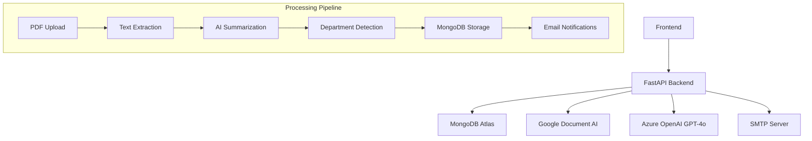

# KKO Backend


A production-ready, async FastAPI backend for intelligent document management with AI-powered text extraction, summarization, and interactive chat capabilities. Built with enterprise-grade integrations and cloud-native architecture.

**🌐 Live Deployment:** This application is hosted on Google Cloud Platform Virtual Machine, ensuring high availability and scalable performance at [kko-backend.adityakumar.live](https://kko-backend.adityakumar.live/docs)

## 🌟 Features

### Core Document Processing
- **🔍 Advanced PDF Text Extraction:** High-accuracy OCR using Google Cloud Document AI
- **🤖 AI-Powered Summarization:** Professional document summaries via Azure GPT-4o
- **📧 Smart Department Detection:** Automatic extraction of organizational units and email addresses
- **💬 Interactive Document Chat:** Context-aware Q&A system for uploaded documents

### API & Infrastructure
- **📄 Paginated Data Access:** Efficient browsing of processed documents (5 items/page)
- **📨 Async Email Notifications:** Background email delivery to detected departments
- **🌐 CORS Enabled:** Full cross-origin support for frontend integration
- **🔄 Health Monitoring:** Built-in health checks and logging

### Security & Performance
- **⚡ Async Processing:** Non-blocking operations with Motor MongoDB
- **🔐 Environment-Based Config:** Secure credential management
- **📊 Comprehensive Logging:** Structured logging for monitoring and debugging

## 🏗️ Architecture



## 🚀 Quick Start

### Prerequisites
- Python 3.11+
- MongoDB Atlas account or local MongoDB
- Google Cloud Project with Document AI enabled
- Azure OpenAI subscription
- SMTP server credentials

### Installation

```bash
# Clone the repository
git clone https://github.com/aditya-Kumar421/kko-backend.git
cd kko-backend

# Install dependencies
pip install -r requirements.txt

# Create environment file
cp .env.example .env
# Edit .env with your credentials
```

### Environment Configuration

Create a `.env` file in the root directory:

```env
# MongoDB Configuration
MONGO_URI
DB_NAME
COLLECTION_NAME

# Azure OpenAI Configuration
AZURE_OPENAI_KEY
AZURE_OPENAI_ENDPOINT
AZURE_OPENAI_DEPLOYMENT
AZURE_OPENAI_API_VERSION

# Google Cloud Document AI
GOOGLE_CREDENTIALS_JSON
GOOGLE_PROJECT_ID
DOCUMENT_AI_LOCATION
DOCUMENT_AI_PROCESSOR_ID

# SMTP Configuration
SMTP_SERVER
SMTP_PORT
SMTP_USER
SMTP_PASSWORD


# CORS Configuration (Optional)
CORS_ORIGINS=http://localhost:3000,https://yourdomain.com
```

### Running the Application

```bash
# Development mode
uvicorn main:app --reload --host 0.0.0.0 --port 8000

# Production mode
uvicorn main:app --host 0.0.0.0 --port 8000 --workers 4
```

## 📚 API Documentation

### Interactive Documentation
- **Swagger UI:** [https://kko-backend.adityakumar.live/docs](https://kko-backend.adityakumar.live/docs)
- **ReDoc:** [https://kko-backend.adityakumar.live/redoc](https://kko-backend.adityakumar.live/redoc)

### API Endpoints Overview

| Method | Endpoint | Description |
|--------|----------|-------------|
| `POST` | `/upload` | Upload and process PDF documents |
| `POST` | `/chat` | Chat with uploaded documents |
| `GET` | `/all` | List all documents with pagination |
| `GET` | `/health` | Service health status |

---

### 📤 POST `/upload`

Upload a PDF document for processing and analysis.

**Request:**
```http
POST /upload
Content-Type: multipart/form-data

file: [PDF file]
```

**Response:**
```json
{
  "filename": "document.pdf",
  "departments": [
    {
      "name": "Human Resources",
      "email": "hr@company.com"
    },
    {
      "name": "Finance Department", 
      "email": null
    }
  ],
  "summary": "• Key point 1\n• Key point 2\n• Important deadline: March 15th",
  "mongo_id": "507f1f77bcf86cd799439011"
}
```

**Error Responses:**
- `400 Bad Request`: Invalid file format or missing file
- `422 Unprocessable Entity`: File processing failed
- `500 Internal Server Error`: Service unavailable

---

### 💬 POST `/chat`

Ask questions about a previously uploaded document.

**Request:**
```json
{
  "mongo_id": "507f1f77bcf86cd799439011",
  "question": "What is the main purpose of this document?"
}
```

**Response:**
```json
{
  "answer": "The document outlines new company policies effective January 2024."
}
```

**Error Responses:**
- `404 Not Found`: Document not found
- `422 Unprocessable Entity`: Invalid mongo_id format

---

### 📋 GET `/all`

Retrieve all processed documents with pagination.

**Query Parameters:**
- `page` (optional): Page number (default: 1)
- `limit` (optional): Items per page (default: 5, max: 50)

**Request:**
```http
GET /all?page=2&limit=10
```

**Response:**
```json
{
  "data": [
    {
      "_id": "507f1f77bcf86cd799439011",
      "filename": "document1.pdf",
      "summary": "Document summary...",
      "departments": [...],
      "created_at": "2024-01-15T10:30:00Z"
    }
  ],
  "pagination": {
    "page": 2,
    "limit": 10,
    "total": 45,
    "total_pages": 5,
    "has_next": true,
    "has_prev": true
  }
}
```

---

### 🏥 GET `/health`

Check service health and dependencies status.

**Response:**
```json
{
  "status": "healthy",
  "timestamp": "2024-01-15T10:30:00Z",
  "services": {
    "mongodb": "connected",
    "document_ai": "available",
    "azure_openai": "available"
  }
}
```


## 🛠️ Development

### Project Structure
```
kko-backend/
├── main.py              # FastAPI application
├── requirements.txt     # Python dependencies
├── .env.example        # Environment template
├── README.md           # Documentation
└── tests/              # Test suite (future)
```

### Dependencies
- **FastAPI**: Modern async web framework
- **Motor**: Async MongoDB driver
- **Google Cloud Document AI**: PDF text extraction
- **Azure OpenAI**: GPT-4o integration
- **aiosmtplib**: Async email sending

### Adding New Features
1. Fork the repository
2. Create a feature branch
3. Implement changes with proper error handling
5. Update documentation
6. Submit a pull request

## 🚀 Deployment

### Docker Deployment
```dockerfile
FROM python:3.11-slim
WORKDIR /app
COPY requirements.txt .
RUN pip install -r requirements.txt
COPY . .
CMD ["uvicorn", "main:app", "--host", "0.0.0.0", "--port", "8000"]
```

### Environment Variables for Production
- Set `CORS_ORIGINS` to your frontend domains
- Use strong, unique credentials
- Enable MongoDB authentication
- Configure proper SMTP settings

## 📊 Monitoring

### Health Checks
The `/health` endpoint provides:
- Service status
- Database connectivity
- External API availability
- Timestamp for monitoring

### Logging
Comprehensive logging includes:
- Request/response cycles
- Error tracking
- Performance metrics

## 🤝 Contributing

We welcome contributions! Please:

1. **Fork** the repository
2. **Create** a feature branch (`git checkout -b feature/amazing-feature`)
3. **Commit** your changes (`git commit -m 'Add amazing feature'`)
4. **Push** to the branch (`git push origin feature/amazing-feature`)
5. **Open** a Pull Request

### Code Style
- Follow PEP 8 guidelines
- Use type hints where possible
- Add docstrings for functions
- Include error handling
- Update tests and documentation

## 📄 License

This project is licensed under the MIT License - see the [LICENSE](LICENSE) file for details.

## 🙏 Acknowledgments

- **Google Cloud Document AI** for robust PDF processing
- **Azure OpenAI** for advanced language capabilities
- **FastAPI** for the excellent async framework
- **MongoDB** for flexible document storage

## 📞 Support

- **Issues**: [GitHub Issues](https://github.com/aditya-Kumar421/kko-backend/issues)
- **Documentation**: [API Docs](https://kko-backend.adityakumar.live/docs)
- **Maintainer**: [aditya-Kumar421](https://github.com/aditya-Kumar421)

---

<div align="center">
  <strong>Built with ❤️ for intelligent document management</strong>
</div>